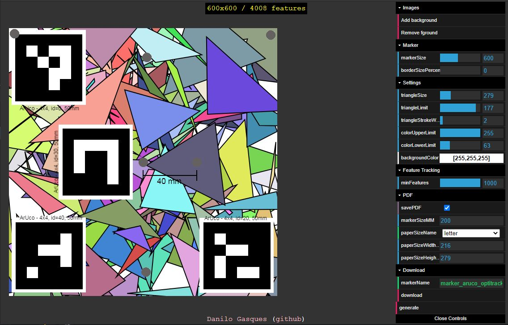

# [AR-Marker-Generator]([https://danilogr.github.io/AR-Marker-Generator/])

A P5.js sketch that generates markers for Augmented Reality applications like [Vuforia](https://www.vuforia.com/), [ARToolkit](https://github.com/artoolkit), and [AR.js](https://github.com/jeromeetienne/AR.js).

This tool
 * Runs from the browser (Tested on Chrome 67+). [Try it](https://danilogr.github.io/AR-Marker-Generator/)
 * Guarantees 5-start trackers on Vuforia. It uses [tracking.js](https://trackingjs.com/) to generate highly trackable markers
 * Produces a PDF with custom marker dimensions (defaults to 8x8 cm) to make printing fast and easy
 * Generates .patt file for ARToolKit and AR.js
 

## [Click here to try](https://danilogr.github.io/AR-Marker-Generator/)

## Future work

I wish that there was a way of telling how the marker's quality degrade over time. I also wish that there was a way of generating a set of markers that are not similar to each other.

If I ever have time, I would 

- [ ] Use [three.js](https://threejs.org/) to render a marker at different distances and angles
- [ ] Use [AR.js](https://github.com/jeromeetienne/AR.js) to assess detection confidence at these different distances and angles
- [ ] Use [tracking.js](https://trackingjs.com/) to see how the number of detected features change over angles and distance

